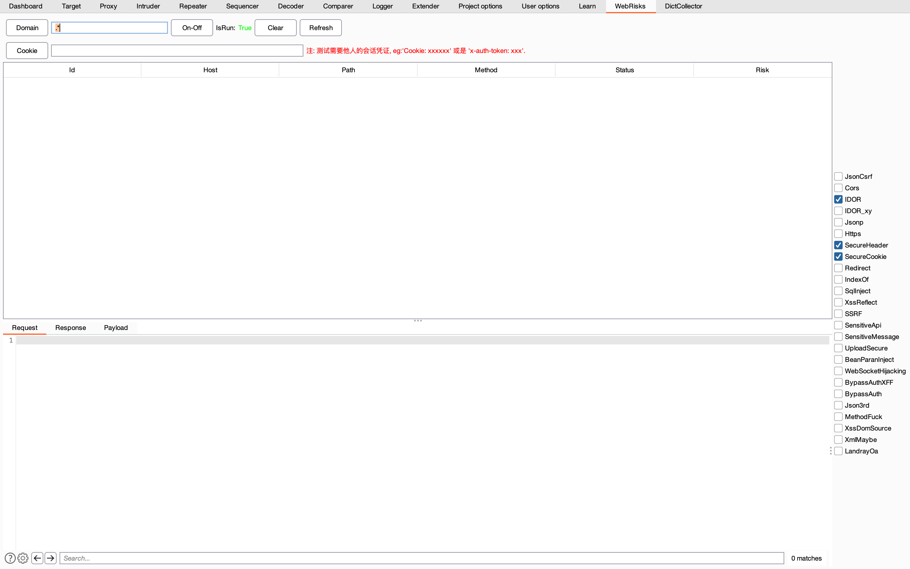
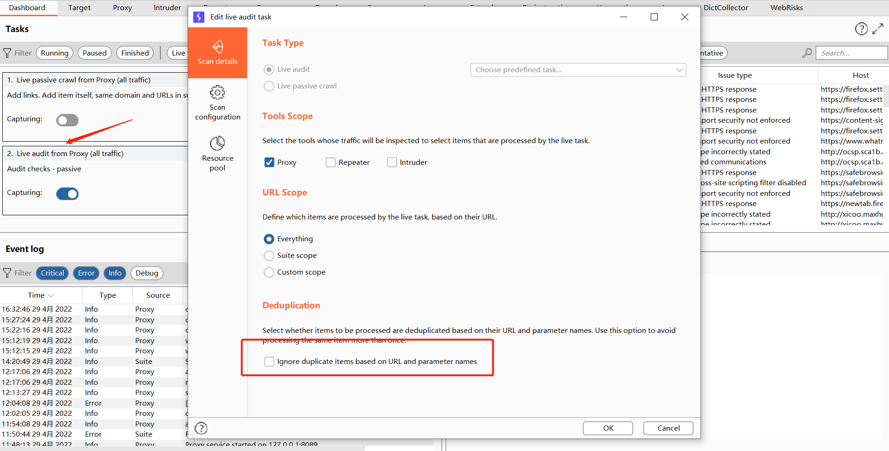

## 设计
1、实现IScannerCheck被动扫描

2、缓存机制，扫描过的不再扫描，减少对业务的影响

3、每类问题只是轻检测，探测可疑问题，不提交大量payload，但是在告警详情里面会附上大量paylaod供手工测试或自动化跑

4、使用okhttp3实现发包器,内置任务队列/等待队列,实现更好的任务执行
## 功能介绍

Domain：可指定测试的域名，限制测试范围

On-Off：插件开关

Clear：清空结果

Cookie：测试越权所需的他人的会话凭证cookie，会话token也可以

Refresh: 刷新表格数据

Payload：列出漏洞的payload列表，供手工测试参考

## 可检测的漏洞
**Web Basic**
- JsonCsrf
- Cors, 会检查是否有csrftoken
- IDOR, 未授权访问
- IDOR_xy, 横纵越权,依据你设置的cookie
- Jsonp
- Https
- Redirect
- SecureCookie
- SecureHeader, 'X-Frame-Options'
- IndexOf
- 反射型XSS
- SQL注入-字符型
- SSRF
- SensitiveApi, eg: /v2/api-docs
- SensitiveMessage, 敏感信息检测: 身份证/手机号/邮箱
- UploadSecure, 上传文件类型限制检测
- BeanParanInject, bean参数注入
- WebSocketHijacking, WebSocket的csrf攻击
- BypassAuthXFF
- Json3rd, 检测使用的json解析组件,如:fastjson

**CVE**
- LandrayOa

## 注意事项
IScannerCheck的被动扫描是依赖burp的被动扫描机制

1、必须开启burp的被动扫描

2、默认是只做一次扫描,所以相同的请求只会进入一次扫描,如果不想要这个特性,可以按下图去掉即可

还有burp的被动扫描必须开哈，不然不会有流量进来，也就是上图箭头指向的那个