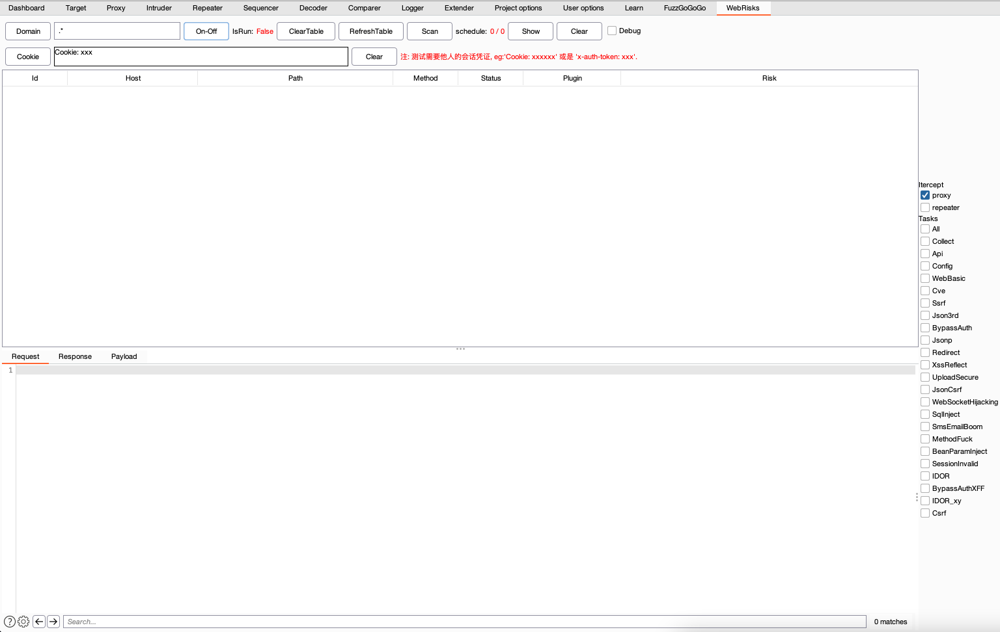

## 设计
1、实现IScannerCheck被动扫描

2、缓存机制，扫描过的不再扫描，减少对业务的影响

3、每类问题只是轻检测，探测可疑问题，不提交大量payload，但是在告警详情里面会附上大量paylaod供手工测试或自动化跑

4、使用okhttp3实现发包器
## 功能介绍

Domain：可指定测试的域名，限制测试范围

On-Off：插件开关

Clear：清空结果

Cookie：测试越权所需的他人的会话凭证cookie，会话token也可以

Payload：列出漏洞的payload列表，供手工测试参考

## 可检测的漏洞
**Web Basic**
- JsonCsrf
- Cors
- IDOR
- IDOR_xy
- Jsonp
- SecureCookie
- Https
- SecureHeader 'X-Frame-Options'
- Redirect
- IndexOf
- 反射型XSS
- SQL注入-字符型

**CVE**
- PutJsp[CVE-2017-12615]
- LandrayOa
